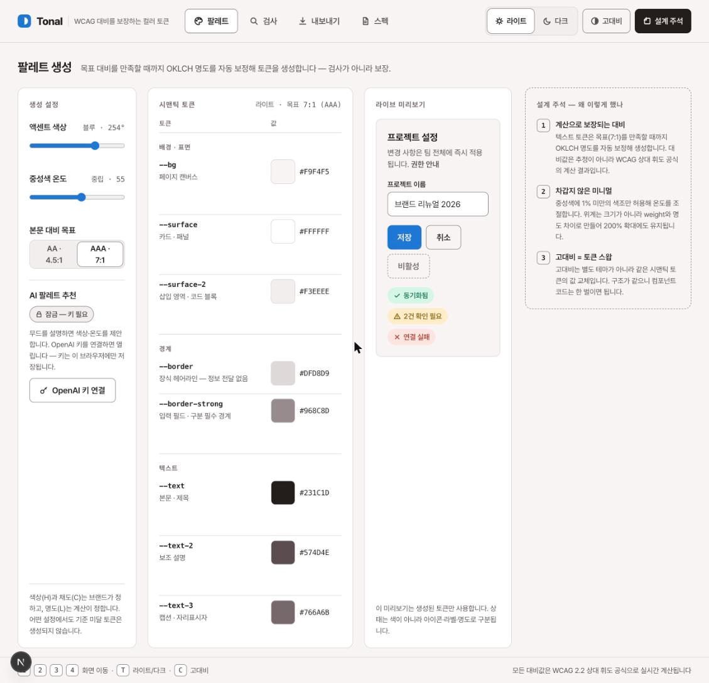
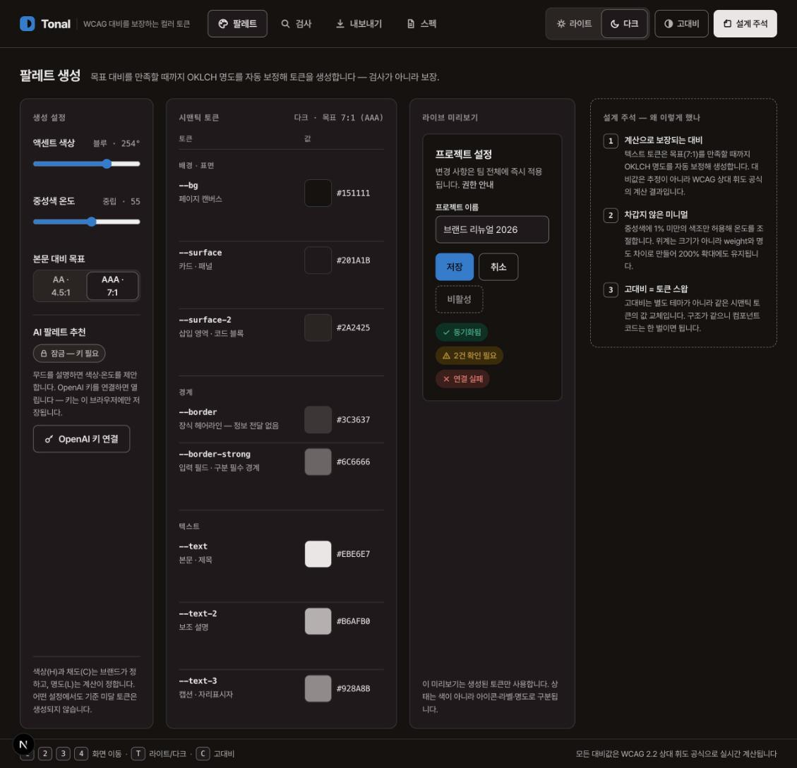
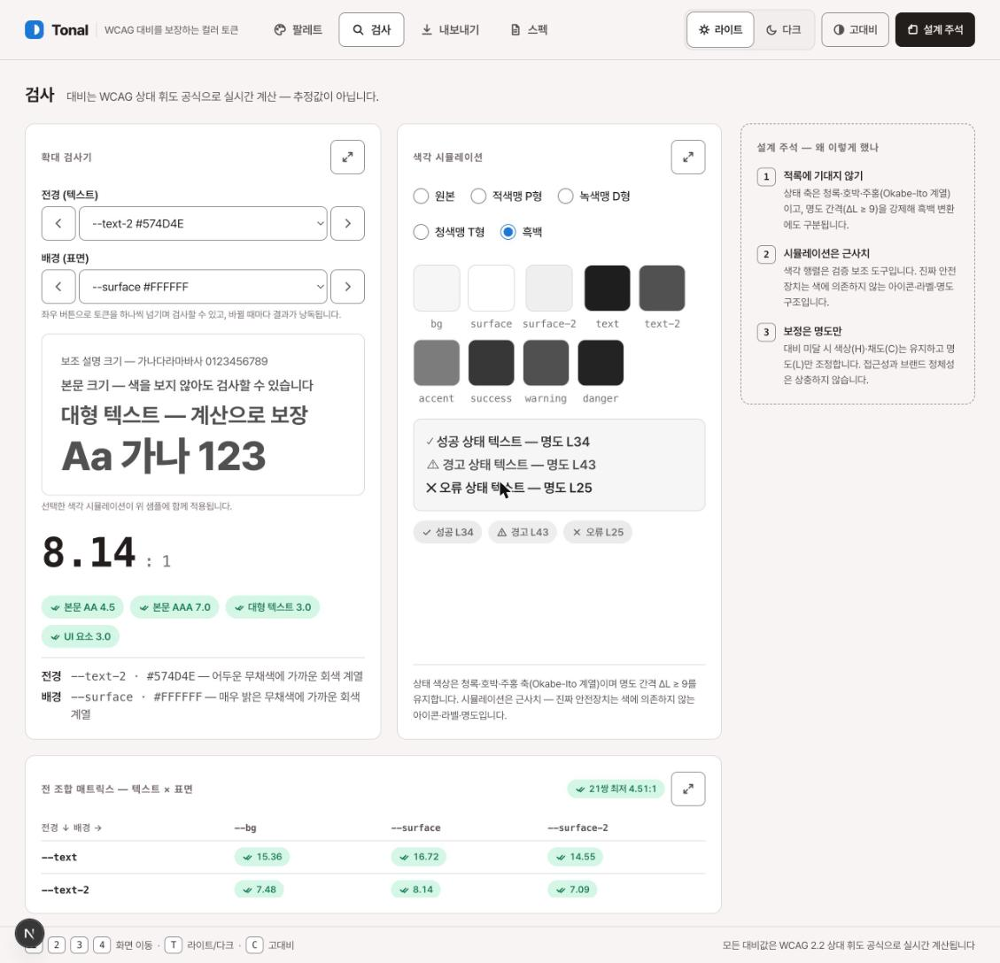

<div align="center">


# Tonal

**색을 보지 않고 설계하는 컬러 토큰 스튜디오**

전맹·저시력·색각이상 사용자가 "결과를 확인받는 사람"이 아니라<br/>
**"직접 설계하고 직접 검사하는 사람"** 이 되는 웹 디자인 툴




</div>

컬러 피커가 없습니다. 색을 고르는 대신 **관계(대비 목표)를 선언**하면, 시스템이 WCAG 대비를 수학으로 보장하는 23개 시맨틱 컬러 토큰을 생성하고, 전 조합을 전수 검사해 증명합니다. AI는 파라미터를 제안할 뿐 **판정에는 절대 개입하지 않습니다.**

**⏱️ 총 작업 시간: 약 4시간** — 기획·디자인 프로토타이핑 ≈ 2시간 + 구현·검증 ≈ 2시간

## ⚡ 빠른 사용법 — 30초 훑어보기

```bash
pnpm install && pnpm dev   # → http://localhost:3000
```

| 순서 | 하는 일 |
|---|---|
| **1. 팔레트** | 슬라이더 2개(액센트 색상·중성색 온도)와 AA/AAA 목표만 정하면 23개 토큰이 즉시 생성됩니다. 컬러 피커는 없습니다 |
| **2. 검사** | ◀▶ 스테퍼로 전경·배경 토큰을 넘기며 검사 — 바뀔 때마다 결과가 낭독됩니다. 색각 시뮬레이션(P/D/T/흑백)과 ⛶ 영역 확대 모달 |
| **3. 내보내기** | CSS 변수 / Tailwind / shadcn(ui) 코드를 복사해 프로젝트에 적용 |
| **4. AI 추천 — 선택** | "OpenAI 키 연결"(BYOK) 후 키워드 칩을 고르거나 무드를 타이핑 — 키가 없어도 나머지 전 기능이 동작합니다 |

우상단 **[설계 주석]** 버튼을 켜면 화면마다 "왜 이렇게 만들었나" 패널이 나타납니다 — 이 문서를 읽지 않아도 제품 안에서 기획 의도를 확인할 수 있습니다. 키보드는 `1`–`4` 화면 이동 · `T` 라이트/다크 · `C` 고대비.

> **목차** — [빠른 사용법](#-빠른-사용법--30초-훑어보기) · [이름의 이유](#-왜-이름이-tonal인가) · [모호함의 구체화](#-과제의-모호함을-이렇게-구체화했다) · [핵심 개념](#-핵심-개념-declare--generate--prove) · [화면과 사용법](#-화면-구성과-사용법) · [사용성](#-사용성을-위해-챙긴-것들) · [Mixed-fidelity](#-mixed-fidelity-프로토타이핑) · [제작 기록](#-제작-과정-기록--커밋별-결정과-이유) · [아키텍처](#-아키텍처) · [검증](#-검증)

---

## 🏷️ 왜 이름이 "Tonal"인가

한마디로 **"색(Hue)이 아니라 톤(명도)으로 승부하는 도구"**라는 뜻입니다.

**① 미술에서 "톤(tone)"은 명도 — 밝고 어두운 정도입니다.**
화가는 채색 전에 흑백 명암만으로 그림 구조를 잡는 "tonal study(명암 습작)"를 합니다. 색을 다 빼도 그림이 성립하는지 확인하는 작업이죠. 이 도구가 하는 일이 정확히 그것입니다 — **색의 "명암 구조"를 설계합니다.**

**② 접근성은 전부 명도 싸움이기 때문입니다.**

- 파란 배경에 흰 글씨가 잘 읽히는 이유는 "파란색이라서"가 아니라 **"배경이 어둡고 글씨가 밝아서"**입니다. WCAG 대비율 공식에는 색조가 아예 등장하지 않습니다 — 두 색의 밝기 비율만 들어갑니다.
- 적록색맹 사용자는 빨강과 초록의 **색조** 구분을 잃지만, **"어느 쪽이 더 밝은가"는 그대로 구분**합니다. 순수한 빨강×초록이 위험한 조합인 이유도 색조가 달라서가 아니라 명도가 거의 같기 때문입니다.
- 전맹 사용자에게 "산뜻한 민트색"은 전달되지 않지만, "밝기 82%, 배경과 대비 7.2:1"은 정확히 전달됩니다. **명도는 수치라서 언어가 됩니다.**

**③ 그래서 도구의 동작 원리 자체가 이름입니다.**
색상(H)과 채도(C)는 브랜드가 정한 대로 절대 건드리지 않고, **명도(L)만 계산으로 조정**해 목표 대비를 맞춥니다. "무슨 색이냐"는 브랜드의 영역, "얼마나 밝냐"는 접근성의 영역 — 이 도구는 후자만 책임지는 도구라서 Tonal입니다.

> **"Colorful(색색깔의)"의 반대말로서의 "Tonal(명암의)"** — 색을 보지 못해도 명암 관계만 올바르면 누구에게나 읽히는 디자인이 된다는 주장을 이름에 박았습니다. 기획 단계의 이름 "Hueless(색조 없이)"를 부정형("색조가 없다")이 아닌 긍정형("톤이 있다")으로 뒤집은 이름이기도 합니다.

## 🧭 과제의 모호함을 이렇게 구체화했다

> "웹 디자인 툴", "시각 장애가 있는 사람도 쓸 수 있어야", "AI를 활용하되 채팅 인터페이스 금지" — 세 조건 모두 해석의 여지가 큽니다.

### 1. "웹 디자인 툴" → 컬러 토큰 빌더로 범위를 좁혔다

디자인의 모든 영역 중 "시각장애인도 쓸 수 있어야 한다"는 조건과 가장 첨예하게 충돌하는 것이 색입니다. 동시에 색은 레이아웃·타이포와 달리 **정답(WCAG 대비 기준)이 수치로 존재해 계산으로 보장할 수 있는 유일한 영역**입니다. "볼 수 없는 사람이 색을 설계한다"는 역설이 성립하는 지점이라 여기에 전부를 걸었습니다.

### 2. "쓸 수 있어야 한다" → 세 사용자군을 1급 사용자로 정의했다

"스크린리더가 안 깨진다" 수준이 아니라, 각 사용자가 도구의 핵심 가치(설계와 검사)를 **직접** 수행할 수 있어야 한다고 정의했습니다.

| 사용자 | 색을 어떻게 다루나 | 이 도구의 답 |
|---|---|---|
| **전맹** | 언어와 수치로 | 모든 색에 언어적 묘사("어두운 선명한 블루 계열") 자동 생성, 조작 즉시 결과 낭독(aria-live), 완전한 키보드 조작 |
| **저시력** | 크게, 뚜렷하게 | 색상칩 확대 모달, 검사 영역째 확대 모달(레이아웃째 1.35배), 고대비 모드, 44px 터치 타겟, 2px 포커스 링 |
| **색각이상** | 색조 없이 | P형·D형·T형·흑백 실시간 시뮬레이션, 상태색은 색+아이콘+라벨 3중 전달, 상태 간 명도 간격(ΔL) 강제 |

### 3. "AI를 활용하되 채팅 금지" → 앵커드(anchored) AI

채팅을 빼는 것이 아니라 **채팅이 필요 없게 만드는 것**이 과제라고 해석했습니다. AI의 입출력을 구조에 고정(anchor)했습니다.

- **입력 앵커** — 자유 대화가 아니라 **키워드 칩 + 무드 한 문장**. 시드 키워드 8종(따뜻한·차분한·신뢰감…)을 누르면 AI가 더 세부적인 연관 키워드 5개를 이어서 제안하고(키워드 체인), 고른 키워드들과 직접 입력이 조합되어 최종 무드가 됩니다. 대화 없이도 디테일을 좁혀갈 수 있습니다.
- **출력 앵커** — 자유 텍스트가 아니라 `{hue: 0–359, warm: 0–100, reason}` 스키마. zod로 검증하고 범위를 클램프합니다.
- **권한 앵커** — AI는 생성 설정의 슬라이더 값을 **제안**할 뿐, 팔레트 생성과 대비 판정은 항상 결정론적 수학이 수행합니다. AI가 거짓말을 해도 접근성이 깨질 수 없는 구조입니다.
- **BYOK** — OpenAI 키를 사용자가 직접 입력합니다(요구사항 준수). 키는 브라우저 localStorage에만 저장되어 OpenAI로 직송되며 서버로 전송되지 않습니다(서버가 없습니다). **키가 없어도 AI 추천 외 전 기능이 동작합니다** — 자동 보정 제안조차 AI가 아닌 수학이므로 키 없이 적용됩니다.

## 🧪 핵심 개념: Declare · Generate · Prove

| 단계 | 무엇을 | 왜 |
|---|---|---|
| **① Declare 선언** | 컬러 피커 없이 브랜드의 의지 2개(액센트 색상, 중성색 온도)와 대비 목표(AA/AAA)만 선언 | 색을 "보고 고르는" 행위 자체를 제거해 전맹 사용자와 비장애 사용자의 설계 행위를 동일하게 |
| **② Generate 생성** | OKLCH 색 공간에서 명도를 0.005 단위로 보정하며 목표 대비를 만족할 때까지 23개 토큰 생성. 라이트/다크 × 일반/고대비 4개 모드가 같은 토큰 구조 | 고대비는 별도 테마가 아니라 값 교체 — 컴포넌트 코드는 한 벌이면 됨 |
| **③ Prove 증명** | 텍스트 7종 × 표면 3종 = 21쌍 전 조합 매트릭스와 WCAG 2.2 검증 리포트(1.4.3 / 1.4.6 / 1.4.11 / 1.4.1 / 2.4.7)로 전수 판정 | 사람이 손으로 못 하는 검사를 시스템이 대신하고, 결과는 항상 실계산값 |

<div align="center">
<table>
<tr>
<td align="center"><br/><sub>다크 모드 — 같은 토큰 구조, 값만 교체</sub></td>
<td align="center"><br/><sub>검사 — 확대 검사기 · 흑백 시뮬레이션 · 21쌍 매트릭스</sub></td>
</tr>
</table>
</div>

## 🖥️ 화면 구성과 사용법

| 키 | 동작 |
|:---:|---|
| `1` – `4` | 팔레트 · 검사 · 내보내기 · 스펙 화면 이동 |
| `T` | 라이트/다크 전환 |
| `C` | 고대비 전환 |

모든 단축키는 하단 푸터에 상시 표시됩니다.

**① 팔레트** — 액센트 색상·중성색 온도 슬라이더와 AA/AAA 목표로 토큰을 생성합니다. 토큰 테이블의 각 행은 대비 실측값과 판정 칩을 함께 표시하고, 색상칩을 누르면 확대 모달(hex·OKLCH·언어적 묘사 포함)이, "크게 검사"를 누르면 해당 토큰이 선택된 채 검사 화면으로 이동합니다. AI 팔레트 추천은 OpenAI 키 연결 후 키워드 칩을 고르거나(고를수록 연관 키워드가 이어짐) 무드를 타이핑해 사용합니다.

**② 검사** — 확대 검사기에서 전경·배경 토큰을 셀렉트 또는 ◀▶ 스테퍼로 바꿔가며 검사합니다. 바뀔 때마다 토큰명·언어적 묘사·대비율·판정이 즉시 낭독되어 화면을 보지 않아도 검사가 완결됩니다. 기준 미달 시 명도만 조정한 자동 보정값을 제안하고 버튼 한 번으로 교체할 수 있습니다(API 키 불필요 — 결정론적 계산). 색각 시뮬레이션은 라디오로 P/D/T/흑백을 전환하며, 각 카드의 ⛶ 버튼으로 영역 전체를 모달로 확대할 수 있습니다.

**③ 내보내기** — WCAG 2.2 검증 리포트와 함께 CSS 변수 / Tailwind / shadcn(ui) 3형식 코드를 복사합니다. 수동 보정한 토큰도 해당 모드에 반영됩니다.

**④ 스펙** — 대비 실측 6쌍(테마 바꾸면 즉시 재계산)과 BYOK 연결 여정 6상태의 UI 스펙 카드입니다.

## ♿ 사용성을 위해 챙긴 것들

접근성 항목이 아니라 **설계 원칙**으로 지킨 것들입니다.

- **낭독은 상태가 아니라 문장** — aria-live 메시지를 "값 변경됨"이 아니라 *"전경 --text-2, 어두운 무채색에 가까운 회색 계열. 배경 --surface. 대비 8.14 대 1, AAA 수준 통과"* 처럼 검사를 완결하는 문장으로 작성했습니다.
- **색은 절대 단독으로 말하지 않는다** — 모든 판정 칩은 색+아이콘+텍스트, 상태 토큰은 명도 간격 ΔL ≥ 9를 생성 단계에서 강제합니다.
- **확대는 어포던스부터** — 색상칩에 호버/포커스 시 돋보기 아이콘이 떠서 "눌러서 크게 볼 수 있다"를 먼저 알립니다.
- **모달 규율** — 열릴 때 낭독·포커스 이동, Tab 트랩, Esc 닫기, 닫으면 연 버튼으로 포커스 복원. 3종 모달(키 연결·색상 확대·영역 확대) 공통.
- **OS 설정 존중** — 최초 방문 시 `prefers-color-scheme` / `prefers-contrast` 반영, `prefers-reduced-motion` 시 전환 애니메이션 제거.
- **뷰포트 고정 레이아웃** — 헤더·화면 타이틀·키보드 가이드 푸터는 항상 보이고, 넘치는 카드만 내부 스크롤됩니다. 길을 잃지 않는 것도 접근성입니다.
- **심미성** — 종이 질감의 웜 뉴트럴 팔레트, Pretendard, 모노스페이스 수치 표기. *"접근성 도구는 못생겨도 된다"는 통념을 반박하는 것 자체가 이 도구의 주장입니다.*

## 🧵 Mixed-fidelity 프로토타이핑

한 가지 충실도로 밀지 않고, 단계마다 비용 대비 전달력이 가장 높은 충실도를 골랐습니다.

```
Lo-fi 기획안 ──▶ Hi-fi 정적 프로토타입 ──▶ 엔진 TDD ──▶ 실사용 검증 루프
 (개념 검증)      (동작 명세 겸용)         (수학 증명)     (브라우저 실측)
                        └─────────── 제품 안의 lo-fi 레이어: "설계 주석" 패널 ───────────┘
```

1. **Lo-fi — 기획안 문서** · "색을 보지 않고 설계한다"는 역설을 글로 먼저 검증했습니다. 코드 이전에 개념이 성립하는지부터.
2. **Hi-fi 정적 프로토타입 — Claude Design** · 4개 화면 전체를 단일 HTML로 만들어 시각 언어·정보 구조·색 수학 로직을 확정했습니다. 이 프로토타입이 곧 **동작 명세**가 되어 구현 단계의 모호함을 제거했습니다.
3. **엔진 우선 TDD** · UI 없이 색 수학(OKLCH 변환·대비·명도 보정·팔레트 생성)을 테스트로 먼저 증명했습니다(현재 70개). "계산으로 보장"이 마케팅 문구가 아니라 테스트로 고정된 사실이 되도록.
4. **실사용 검증 루프** · 브라우저에서 실제 조작·실측(문서 스크롤 픽셀 단위 진단, 터치 타겟 크기 측정, 375px 렌더 검증)하며 고쳤습니다.
5. **제품 안의 lo-fi 레이어** · 우측 "설계 주석" 패널은 화면마다 "왜 이렇게 했나"를 스케치 톤(점선 카드)으로 노출합니다. 스펙 화면의 BYOK 6상태 카드도 mock UI로 상태 여정을 보여주는 제품 내 프로토타입입니다. 낮은 충실도의 설명을 완성품 안에 의도적으로 남겨, **도구 자체가 제작 기록을 겸하게** 했습니다.

## 📜 제작 과정 기록 — 커밋별 결정과 이유

사소해 보이는 수정에도 이유를 남깁니다. `git log --reverse`와 같은 순서입니다.

<details>
<summary><b>전체 커밋 기록 펼치기</b> (17건)</summary>
<br/>

| 커밋 | 무엇을 | 왜 |
|---|---|---|
| `0f98984` | 색 수학 엔진 + 테스트 35개 선행 | 판정의 신뢰가 제품의 전부라서 UI보다 증명을 먼저. OKLCH→sRGB 행렬, 가멋 클램프(채도 0.004씩 감소), WCAG 휘도·대비, 명도 보정(fit)을 알려진 값 쌍으로 고정 |
| `4a06935` | 코드 생성기 + BYOK 클라이언트 | 키 형식 검사(요청 전 차단)→`GET /v1/models` 검증(8초 타임아웃), 오류를 형식/인증/한도/네트워크 4종으로 분류해 각각 다른 복구 안내 제공 |
| `5965555` | 4개 화면 UI + 키 다이얼로그 | 스킵 링크, 테이블 caption/scope, aria-current, 포커스 트랩 등 접근성 뼈대를 처음부터. 나중에 붙이는 접근성은 항상 샌다 |
| `ff05629` | OpenAI 클라이언트 테스트 보강 | 네트워크 없는 CI에서도 오류 4분기가 검증되도록 fetch 목킹 |
| `271dc13` | 확대 검사기·언어적 묘사·"크게 검사" | 사용자 피드백 "토큰이 작아 장애인이 직접 확인하기 어렵다" 반영. 검사 결과를 보여주는 카드가 아니라 검사하는 도구로 재정의 — 4단계 크기 실물 샘플 + `describeColor`(명도 5단계 × 채도 3단계 × 색상 11계열의 언어 조합) |
| `545b0b6` | ◀▶ 스테퍼 + 즉시 낭독, 시뮬레이션 확대 | 셀렉트는 스크린리더로 목록 탐색 부담이 큼 — 버튼 한 번 = 다음 토큰 + 전체 결과 낭독으로 "귀로 하는 브라우징" 구현. 하이드레이션 경고는 브라우저 확장의 body 속성 주입이 원인이라 `suppressHydrationWarning`으로 한정 대응 |
| `a26fbc9` | 검사기·시뮬레이션 카드 높이 정렬 | 나란한 카드의 높이 불일치는 저시력 확대 시 시선 이동 비용이 됨 |
| `67ebace` | 색상칩 44px + 확대 모달 + 호버 돋보기 | 스와치를 장식에서 버튼으로. 돋보기 어포던스는 "누를 수 있는지 몰라서 못 쓰는" 문제의 대응 |
| `af84b02` | 자동 보정 적용(오버라이드 레이어) + 토글 색상 버그 | 보정값은 생성 입력이 같을 때만 유효한 오버라이드로 저장 — 재생성하면 자동 무효화되어 낡은 보정이 몰래 남지 않음. 적용 즉시 21쌍 재검증 결과를 낭독. 버그는 Tailwind 색상 유틸이 겹치면 클래스 순서가 아닌 CSS 생성 순서로 승자가 정해지는 함정 — 켬/끔 스타일을 한 벌만 조건부 적용하는 구조로 수정 |
| `f18d854`–`c6ff6dc` | 뷰포트 고정 + 카드별 내부 스크롤 | 키보드 가이드 푸터가 항상 보여야 한다는 원칙의 실현. 문서 스크롤의 진범은 `sr-only`(absolute) 요소가 포지셔닝 조상이 없어 overflow 클리핑을 탈출한 것 — 루트 `relative` 한 줄로 봉쇄하고 픽셀 실측(scrollHeight == viewport)으로 확정 |
| `8284201` | 검사 화면 영역 확대 모달 + 스크롤 정책 | 검사기는 스크롤 없이 통짜(검사 도구가 잘리면 안 됨), 매트릭스만 내부 스크롤. ⛶ 버튼으로 영역째 CSS `zoom` 확대 — 글자·칩·표가 실제로 커지는 저시력용 확대. 모달 속 카드는 원본과 상태를 공유해 어디서 조작해도 동일 |
| `ec9e7c8` | 색상 확대 모달 포털 대상 수정 | body로 포털하니 앱 루트에 주입된 색 토큰 CSS 변수 스코프를 벗어나 배경이 투명해짐 — 포털 대상을 테마 루트로. 동적 테마의 CSS 변수 스코프와 React 포털이 충돌하는 사례 |
| `5277a27` | 모바일 헤더 | 전폭 4등분 탭(44px 유지), 테마 컨트롤은 아이콘화하되 라벨을 `sr-only`로 보존 — 시각적 축약이 스크린리더 이름을 지우면 안 됨. 480px 미만에선 탭 아이콘을 숨겨 한글 라벨을 보호 |
| `99fda25` | 무드 키워드 체인 | 시드 칩 클릭 → AI 연관 키워드 5개가 점선 칩으로 이어짐(제안의 시각 언어) → 조합해 추천 실행. 선택·추가 모두 aria-pressed와 즉시 낭독. 연타 시 낡은 응답은 요청 카운터로 폐기. 선택 직후 같은 키워드가 selected·extra 양쪽에 남아 React key가 중복되던 버그를 렌더 시 중복 제거로 수정 |
| `1c6c533` | README 전면 작성 | 기획 의도·모호함 구체화·평가 기준 대응·커밋별 제작 기록을 문서화 |

</details>

## 🏗️ 아키텍처

```
src/
  lib/color/    색 수학 엔진 — 순수 함수, UI 무의존, 테스트로 고정 (커버리지 99%)
  lib/export/   CSS 변수·Tailwind·shadcn 코드 생성
  lib/openai/   BYOK: 키 저장·검증·팔레트 제안·키워드 확장 (zod 스키마 검증)
  hooks/        테마(OS 감지+저장)·키 상태 머신·키보드 단축키·무드 키워드 체인
  components/   4개 화면 + 3종 모달 + 공용 UI — 팔레트는 CSS 변수로 루트에 주입
```

> **판정 로직이 UI에 한 줄도 섞여 있지 않다**는 것이 이 구조의 요점입니다. `buildPalette(dark, hc, hue, warm, aaa)`는 같은 입력에 항상 같은 23개 토큰을 반환하는 순수 함수이고, 매트릭스 21쌍이 4개 모드 전부에서 기준을 통과함을 테스트가 상시 증명합니다.

## ✅ 검증

```bash
pnpm vitest run   # 테스트 70개 (색 엔진·코드 생성·BYOK 오류 분기·키워드 체인)
pnpm lint && pnpm tsc --noEmit
pnpm build
```

브라우저 실측: 4화면 전환(클릭+단축키), 테마·고대비 토글 시 토큰 재계산, 문서 스크롤 0px(뷰포트 고정), 모달 3종의 포커스 트랩·복원, 모바일(375px) 오버플로 없음, 콘솔 에러 없음.
